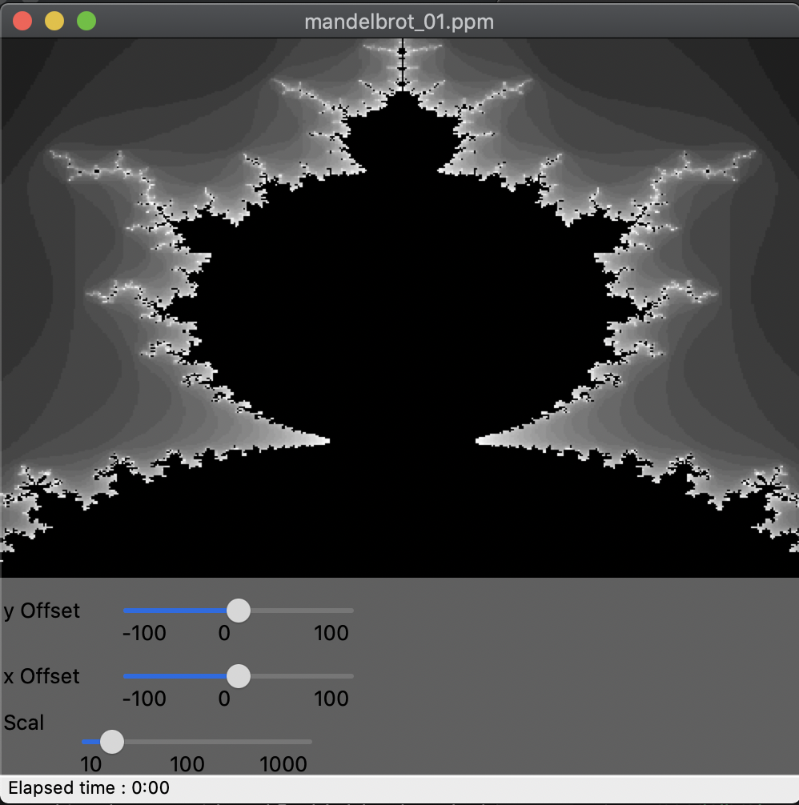

## Capstone Project - A Mandelbrot set viewer
This is a C++ project that draws a mandelbrot set using WxWidgets to build the GUI.

### Rubric Part 1 : Compiling and Testing
WxWidgets will need to be installed.  See [wxwidgets home page](https://www.wxwidgets.org/) for details.
Instructions for building and running:
- git clone https://github.com/mansonjones/Cpp-Mandelbrot.git
- cd Cpp-Mandelbrot
- mkdir build
- cd build
- cmake .. && make
- ./mandelbrot 

Once launched, the app looks like this:

### Rubric Part 2 : Files and class structure.

| Class | Description |
| -------------- | -------------------------------------------------------------------------------------- |
| AutoSave | Manages the autosave process. |
| Constants | Used to store application constants. |
| ImageBuffer | Stores an RRB image and provides basic RGB read / write operations |
| ImageIO, ImageIO_PPM | A class factory for file IO services. |
| MainFrame | Inherits from the WxWidgets class WxFrame. |
| Mandelbrot | Renders a mandelbrot set into an image buffer. |  
| MandelbrotApp | Inherits from the WxWidgets class wxApp.  This is the launch point for the app. |
| MandelbrotPanel | Inherits from the WxWidgets class WxPanel.  Used to render the Mandelbrot set. |
| MessageQueue | A concurrent message queue. |
| MainFrame | Main WxWidgets class |
| SaveJob | Used to save images |

### Rubric Part 3 : Loops, Funcions, I/O
1. The project demonstrates an understanding of C++ functions and control structures. *This is evident throughout.*
2. The project reads data from a file and process the data, or the program writes data to a file.  *Use File->Save to
save a file.*
3. The project accepts user input and processes the input. *You can use sliders to offset the mandelbrot image in x and y,
or scale it.*

### Rubric Part 4 : Object Oriented Programming
1. The project uses Object Oriented Programming techniques.  *This is evident throughout.*
2. Classes use appropriate access specifiers for class members. *See ImageBuffer.*
3. Class constructors utilize member initialization lists. *See ImageBuffer.*
4. Classes abstract implementation details from their interfaces. *See Mandelbrot.*
5. Classes encapsulate behavior. *See Mandelbrot.*
6. Classes follow an appropriate inheritance hierarchy. *See ImageIO, ImageIO_PPM.*
7. Overloaded functions allow the same function to operate on different parameters. *See ImageIO, ImageIO_PPM.*
8. Derived class functions override virtual base class functions. *See ImageIO, ImageIO_PPM.*
9. Templates generalize functions in the project. *See ImageBuffer.*

### Rubric Part 5 : Memory Management
1. The project makes use of references in function declarations. *See Mandelbrot.*
2. The project uses destructors appropriately. *See ImageBuffer.*
3. The project uses scope / Resource Acquisition Is Initialization (RAII) where appropriate. *See ImageBuffer.*
4. The project follows the Rule of 5. *See ImageBuffer.*
5. The project uses move semantics to move data, instead of copying it, where possible. *See use of std::move in AutoSave, MessageQueue, SaveJob, and MainFrame.*
6. The project uses smart pointers instead of raw pointers. *See use of std::unique in MandelbrotPanel.*

### Rubric Part 6: Concurrency
1. The project uses multithreading.  *See use of threads in class MainFrame.*
2. A promise and future is used in the project. *See use of promise / futures in MainFrame.*
3. A mutex or lock is used in the project. *See use of mutexes in MessageQueue and SaveJob.*
4. A condition variable is used in the project. *See use of condition variable in MessageQueue.*

 
